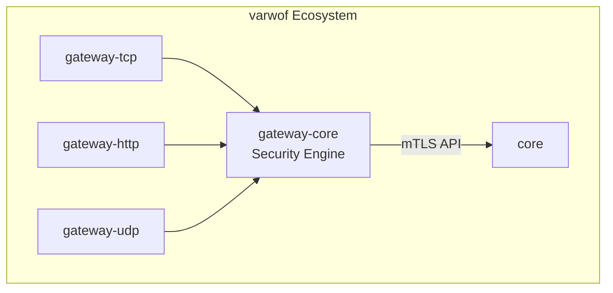

# varwof-gateway-core

> Shared security engine library — unified mTLS, CRL, OCSP, TSA, RBAC, audit, metrics, and decision capabilities for gateway-tcp/http/udp.

[](LICENSE)
[](https://pkg.go.dev/github.com/varwof/gateway-core)

[中文](README_CN.md)

## What is varwof-gateway-core?

Shared security engine library providing unified mTLS, CRL, OCSP, TSA, RBAC, audit, metrics, decision, and short-lived certificate capabilities for gateway-tcp/http/udp. Pure Go, zero external dependencies.

## Quick Start

```go
import gw "github.com/varwof/gateway-core"

// CRL cache
caCert, _ := gw.LoadCACert("ca.pem")
crlCache := gw.NewCRLCache(caCert, "http://crl.example.com/ca.crl", 1800, nil, "zh")

// RBAC
roles := gw.ExtractRoles(cert)
if !gw.CheckRole(roles, []string{"gateway:admin"}) {
    // reject
}

// Audit log
audit, _ := gw.NewAuditLogger("/var/log/pki/audit.log", nil, 100*1024*1024, 3)
audit.Log(gw.AuditEntry{Action: "connection_allowed", ClientCN: "user@example.com"})
```

## Installation

```bash
go get github.com/varwof/gateway-core@v0.1.0
```

## Core Modules

| Module | Description |
|--------|-------------|
| CRL/OCSP Cache | Certificate revocation list + online status query |
| TSA Client | RFC 3161 timestamp request and verification |
| RBAC | Role extraction from certificate OU |
| Audit Log | JSON Lines + Merkle hash chain |
| Metrics | Prometheus Counter/Gauge/Histogram |
| Unified Pipeline | CRL → OCSP → RBAC → AIC → constraints → plugins |
| Policy Versioning | Monotonic version + history + branch control |

## Ecosystem



gateway-core is the **shared security engine layer** for the three gateways. This project is a member of the [Open Invention Network](https://openinventionnetwork.com/).

## Links

| | |
|---|---|
| Homepage | https://varwof.com |
| Community | https://varwof.org |
| IETF Draft | [draft-wei-aic-identity-cert](https://datatracker.ietf.org/doc/draft-wei-aic-identity-cert/) |
| License | Apache-2.0 |
| Member | [Open Invention Network](https://openinventionnetwork.com/) |
